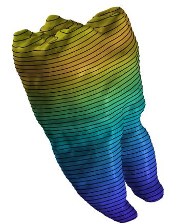

# IsoCut

IsoCut Toolbox is a set of Matlab functions for cutting triangular surface meshes along level set(s) of scalar fields 
defined at the mesh vertices. The three primary functions are:

>**`IsoContour.m`**: extracts and visualizes line segments comprising level sets of a scalar field 

>**`OrderIsoContourVerts.m`**: organizes line segments generated by the `IsoContour` function to produce iso-contours 
with sequentially ordered vertices

>**`IsoCut.m`**: computes cut along level set of a scalar field and locally modifies connectivity of the mesh so it contains edges along the cut

## Demo 1: Planar cuts/iso-contours

Extract and visualize planar contours at the intersection of mesh with k uniformly spaced cutting planes:
	
	n=1; 				% index of principal axis specifying cutting plane normal
	k=50;				% number of cuts
	IsoCut_demo1(n,k)
	

	
Try calling `IsoCut_demo1` with different values of `k` and `n`. Inspect code for more info.

## Demo 2: Non-planar cuts/iso-contours

Examples of iso-contours on a unit sphere:
	
	k=20;				% number of level sets
	IsoCut_demo2(k)

	
Try calling `IsoCut_demo2` different values of `k`; must be an integer between 1 and 20.

## Demo 3: Modify mesh connectivity to include edges along a cut

The previous demos showed how to extract the coordinates of the cuts/iso-contours. However, there may be applications that
require insertion of the iso-contour polyline into the surface mesh. Doing so, for example, would allow us to perform 
'surgery' on the surface so that the faces of the modified mesh to one side of the cut can be neatly separated from the 
faces on the other side to obtain two separate meshes. ***The cuts can be planar or non-planar. However, they must be closed 
and non self-intersecting.*** 

	iv=0.6;				% iso-value
	IsoCut_demo3(iv)

Try calling `IsoCut_demo3` different values of `iv`; must be between 0.01 and 0.99

 
## Assumptions and Limitations

1. The function `OrderIsoContourVerts` assumes that
	- computed level sets do not pass through saddle points of the input scalar field
	- iso-contours extracted from closed surfaces are closed
	- iso-contours extracted from open surfaces are either open or closed, but the end-points of open contours terminate at the 
	surface boundary

2. At this time, the function `IsoCut` works only for closed iso-contours. The special case where the cut intersects
 with boundary edges is not yet supported. You do NOT have to worry about this exception if 
   (a) the input surface mesh is closed, OR 
   (b) the input surface mesh is open AND the cut does not intersect any of its boundary edges    

3. Level sets are computed using linear interpolation. *If the field defined at the mesh vertices is produced by a 
***nonlinear*** function (F), the iso-contours computed with `IsoContour.m` will be approximations of the corresponding level 
sets of F.* In those cases, the only way to increase the accuracy of the extracted iso-contours is to linearly subdivide the 
mesh (prior to calculation of the scalar field at the vertices) until the error is below desired tolerance (e.g., see [TriQuad.m]
from the [S2-Sampling-Toolbox] repo). If there is sufficient interest in an accurate extraction of iso-contours for nonlinear scalar
fields, I can incorporate a zero-finding algorithm into the 'IsoContour' function, sometime in the future.

If you encounter any bugs/problems with this code you can e-mail me or repot the issue [here].

## License
[MIT] © 2021 Anton Semechko (a.semechko@gmail.com)

[TriQuad.m]: https://github.com/AntonSemechko/S2-Sampling-Toolbox/blob/master/TriQuad.m
[S2-Sampling-Toolbox]: https://github.com/AntonSemechko/S2-Sampling-Toolbox
[here]: https://github.com/AntonSemechko/IsoCut/issues
[MIT]: https://github.com/AntonSemechko/IsoCut/blob/master/LICENSE.md